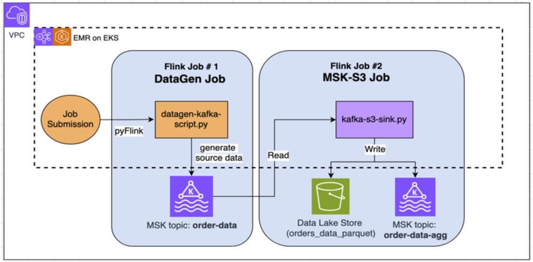

# Demostration for Flink on EMR on EKS

# Architecture Diagram



# Get Started

1. Manually create a "provisioned" MSK cluster via AWS console. Make sure it's in the same VPC as the EKS cluster. 

2. Go to an EC2 or Cloud9 or on your local machine, setup the environment variables and ensure you can connect to the kafka cluster and an existing EKS cluster:
```bash

sudo yum install -y bash-completion jq

NAMESPACE=emr-flink
EMR_VERSION=7.9.0
AWS_REGION=us-west-2
AWS_ACCOUNT_ID=$(aws sts get-caller-identity --query Account --output text)
BUCKET_NAME=my-demo-bucket

CHECKPOINT_S3_STORAGE_PATH=s3://${BUCKET_NAME}/flink/autoscaling/checkpoint/
SAVEPOINT_S3_STORAGE_PATH=s3://${BUCKET_NAME}/autoscaling/savepoint/
HIGH_AVAILABILITY_STORAGE_PATH=s3://${BUCKET_NAME}/flink/autoscaling/ha/
# assume the IRSA role and EKS cluster exist already
EMR_EXECUTION_ROLE_ARN=$(aws iam get-role --role-name emr-on-eks-test-execution-role | jq -r .Role.Arn)
JOB_SCRIPT_FILE=s3://${BUCKET_NAME}/flink/script/datagen-kafka-script-flink-1-19.py
JOB_SCRIPT_FILE_NAME=datagen-kafka-script-flink-1-19.py
ORDER_DATA_TOPIC_NAME="order-data"
ORDER_DATA_AGG_TOPIC_NAME="order-data-agg"

# Assume only one MSK cluster in the AWS account
MSK_ARN=$(aws kafka list-clusters  |jq -r  .ClusterInfoList[0].ClusterArn)
MSK_BROKER=$(aws kafka get-bootstrap-brokers --cluster-arn $MSK_ARN |jq -r .BootstrapBrokerString)

echo -e " $NAMESPACE \n $BUCKET_NAME \n $CHECKPOINT_S3_STORAGE_PATH \n $SAVEPOINT_S3_STORAGE_PATH \n $HIGH_AVAILABILITY_STORAGE_PATH \n $EMR_EXECUTION_ROLE_ARN \n $JOB_SCRIPT_FILE \n $JOB_SCRIPT_FILE_NAME \n $MSK_BROKER \n $ORDER_DATA_TOPIC_NAME \n$ORDER_DATA_AGG_TOPIC_NAME \n $EMR_VERSION"
```
3. Install the latest Flink Operator (emr7.9) from the EC2 or Cloud9
```bash

kubectl config set-context --current --namespace $NAMESPACE

# Install the cert-manager (once per Amazon EKS cluster) to enable adding the webhook component
kubectl apply -f https://github.com/cert-manager/cert-manager/releases/download/v1.12.0/cert-manager.yaml

# Install the operator on an operation node with the nodeSelector
export VERSION=7.9.0
export NAMESPACE=emr-flink

helm install flink-kubernetes-operator \
oci://public.ecr.aws/emr-on-eks/flink-kubernetes-operator \
--version $VERSION \
--namespace $NAMESPACE \
-f helm/emr-flink-operator-values.yaml

```

4. Install kafka client tool on the EC2 or Cloud9 environment:
```bash
wget https://archive.apache.org/dist/kafka/2.8.1/kafka_2.12-2.10.1.tgz .
tar -xvzf  kafka_2.12-2.10.1.tgz
cd kafka_2.12-2.10.1
```
5. Create 2 empty kafka topics:
```bash
# Source Topic : 12 partition
./bin/kafka-topics.sh --bootstrap-server $MSK_BROKER --create  --replication-factor 2 --partitions 12 --topic $ORDER_DATA_TOPIC_NAME
./bin/kafka-topics.sh --bootstrap-server $MSK_BROKER --topic $ORDER_DATA_TOPIC_NAME --describe

# Output Topic : 6 partition
./bin/kafka-topics.sh --bootstrap-server $MSK_BROKER --create  --replication-factor 2 --partitions 6 --topic $ORDER_DATA_AGG_TOPIC_NAME
./bin/kafka-topics.sh --bootstrap-server $MSK_BROKER --topic $ORDER_DATA_AGG_TOPIC_NAME --describe
```
6. Create an EBS storage class to be used by flink's "local recovery", and install Karpenter to provision compute resources:
```bash
eksctl create addon \
   --name aws-ebs-csi-driver \
   --region $AWS_REGION \
   --cluster $EKS_CLUSTER \
   --service-account-role-arn arn:aws:iam::$AWS_ACCOUNT_ID:role/AmazonEKS_EBS_CSI_DriverRole

cat << EOF -> storage-class.yaml
apiVersion: storage.k8s.io/v1
kind: StorageClass
metadata:
  name: ebs-sc
provisioner: ebs.csi.aws.com
volumeBindingMode: WaitForFirstConsumer
EOF

kubectl apply -f storage-class.yaml
kubectl get sc

# update the karpaenter installation script to match your own EKS version.
Curl -O https://raw.githubusercontent.com/hitsub2/flink-on-eks/main/karpenter.sh
chmod +x karpenter.sh
bash karpenter.sh
```

7. Build 2 docker multi-platform images
```bash
#login to ecr
aws ecr get-login-password --region ${AWS_REGION} |docker login --username AWS --password-stdin ${ACCOUNT}.dkr.ecr.${AWS_REGION}.amazonaws.com
# create ecr repos ( once-off )
REPO_NAME=emr-$EMR_VERSION-flink-datgen-msk
aws ecr create-repository --repository-name ${REPO_NAME} --image-scanning-configuration scanOnPush=true --region ${AWS_REGION}
REPO_NAME=emr-$EMR_VERSION-flink-msk-s3
aws ecr create-repository --repository-name ${REPO_NAME} --image-scanning-configuration scanOnPush=true --region ${AWS_REGION}

# build and push
docker buildx build --platform linux/amd64,linux/arm64 \
-t $AWS_ACCOUNT_ID.dkr.ecr.$AWS_REGION.amazonaws.com/emr-$EMR_VERSION-flink-datgen-msk \
-f Dockerfile-datgen \
--build-arg EMR_VERSION=${EMR_VERSION} \
--push .

docker buildx build --platform linux/amd64,linux/arm64 \
-t $AWS_ACCOUNT_ID.dkr.ecr.$AWS_REGION.amazonaws.com/emr-$EMR_VERSION-flink-msk-s3 \
-f Dockerfile-msk-s3 \
--build-arg EMR_VERSION=${EMR_VERSION}  \
--push . 
```
8. Upload 2 pyFlink app scripts to s3:
```bash
aws s3 cp pyflink_app/kafka-s3-sink-flink1-19.py s3://$BUCKET_NAME/flink/script/kafka-s3-sink-flink1-19.py
aws s3 cp pyflink_app/datagen-kafka-script-flink-1-19.py  s3://$BUCKET_NAME/flink/script/datagen-kafka-script-flink-1-19.py  
```
9. test the jobs:
```bash
# generate source data sent to kafaka
kubectl apply -f flink-datagen-kafka.yaml  -n $NAMESPACE

# consume the source and save them to S3 in parquet file format
# also aggregate the raw data then output to kafka
kubectl apply -f flink-kafka-s3.yaml  -n $NAMESPACE
```
10. Validate in Kafka:
```bash
# source topic
bin/kafka-console-consumer.sh --bootstrap-server  $MSK_BROKER  --topic $ORDER_DATA_TOPIC_NAME
#output topic
bin/kafka-console-consumer.sh --bootstrap-server  $MSK_BROKER  --topic $$ORDER_DATA_AGG_TOPIC_NAME
```
11. [OPTIONAL] Create a Flink WebUI ingress (public) or simply port-forward
```bash
kubectl port-forward svc/flink-kafka-s3-rest 8081  -n $NAMESPACE

# NOTE: an internet-facing ALB will be created which is accessible by the world (NOT RECOMMENDED)
kubectl -f ingress/ingress-public-kafka-s3.yaml
# The better way is to create this internal private ALB, login to a jumpbox and access to the Flink WebUI within the same VPC
kubectl -f ingress/ingress-private-kafka-s3.yaml
```

12. Clean up
```bash
kubectl delete -f flink-datagen-kafka.yaml  -n $NAMESPACE
kubectl delete -f flink-kafka-s3.yaml  -n $NAMESPACE
```


